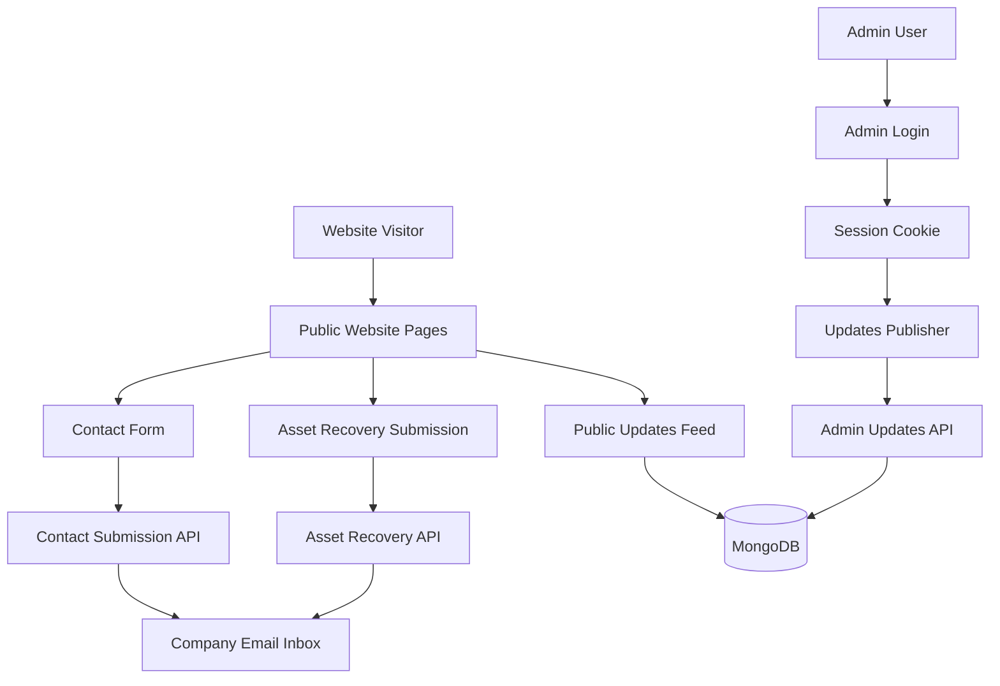

# AVLC Group Website Presentation Pack

Prepared for Dmura

## Purpose of This Pack

This document is designed to help present the AVLC Group website in two settings:

- A business and stakeholder presentation focused on value, structure, and user experience
- A follow-up presentation focused on features, administration, and technical implementation

## Executive Summary

The AVLC Group website is a multi-page corporate website built to present the AVLC brand, showcase group companies, highlight patented products, publish updates, share tender opportunities, and receive direct customer inquiries. The website also includes an authenticated admin area for managing public updates.

The current implementation supports:

- Corporate homepage and brand presentation
- About AVLC Group content
- Dedicated pages for AVLC group companies
- Patented products content with interactive product popouts
- Tender openings by country
- Contact form submission to company email
- Asset recovery form submission to company email
- Public updates timeline feed
- Admin login and updates publishing workflow backed by MongoDB

## Business Goals Supported by the Website

The website supports these core business outcomes:

- Establish AVLC Group's digital presence with a structured corporate identity
- Present AVLC's subsidiaries and product lines in a clear, navigable format
- Improve lead capture through direct contact and inquiry forms
- Support business development through tender and product visibility
- Give internal staff an admin-side process for posting public updates without editing code

## Website Scope

## Public-Facing Pages

- Homepage
- About AVLC Group
- Company pages for group subsidiaries
- Our Patented Products
- Tender Openings
- Updates
- Contact

## Admin Pages

- Admin login
- Admin updates publisher

## Key Public Features

### Homepage

The homepage introduces AVLC Group, highlights the company's positioning, presents the introduction section near the top of the page, and provides a visible entry point into the group companies.

### About AVLC Group

The About page presents:

- Group background
- Vision and key strategy
- Core values
- Directors
- Partner organizations

### Our Companies

The website includes a navigation dropdown for the AVLC companies and dedicated pages for each major company profile. These pages carry company-specific summaries and structured content blocks.

### Our Patented Products

The patented products page presents products such as:

- Asset Recovery
- Child Guard
- Lifestyle Lady
- Pesa na Pesa
- Bima Hima
- LandBank Solution

The page includes clickable product cards that open a scrollable popout with product details, while keeping the long-form content visible further down the page.

### Tender Openings

Tender openings are organized by country and include downloadable tender documents where available.

### Updates

The updates page functions as a timeline feed for:

- Announcements
- Partnerships
- Tender notices
- Product milestones

The public feed supports filtering and refresh behavior, while the admin side supports content management.

### Contact

The contact page includes:

- Office address
- Phone and email contacts
- Message form
- Map embed

Contact submissions are delivered to company email using SMTP configuration.

### Asset Recovery Submission Flow

The patented products page includes an asset recovery workflow with:

- Claiming instruction form selection
- File upload
- Submission handling

Submitted asset recovery forms are sent to company email with attachments.

## Admin and Operations Features

## Admin Authentication

The admin area uses:

- Username and password login
- Session cookies
- MongoDB-backed session validation

This allows an admin to sign in once and manage updates without entering a token repeatedly.

## Updates Publisher

The admin updates interface supports:

- Creating updates
- Editing updates
- Publishing or unpublishing updates
- Deleting updates

Published entries appear on the public updates page.

## Technology Stack

- Next.js App Router
- React
- TypeScript
- Tailwind CSS
- ESLint
- Nodemailer for email delivery
- MongoDB for admin users and sessions

## Architecture Overview

## Content and Asset Strategy

The website has been refactored so that logos, images, and downloadable documents are stored locally in project assets instead of hotlinking external resources. This improves presentation reliability and reduces dependence on third-party sites.

Local assets now include:

- Branding images
- Company logos
- Partner logos
- Patented product logos
- Tender documents
- Product terms documents
- Asset recovery forms

## Thursday Presentation Plan

Use Thursday to focus on business value and user experience.

### Suggested Flow

1. Introduce AVLC Group and the purpose of the website
2. Walk through the homepage and brand positioning
3. Show the About AVLC Group page
4. Open the Our Companies dropdown and demonstrate individual company pages
5. Show the Our Patented Products page and use one popout example
6. Show the Contact page and explain inquiry capture

### Key Talking Points

- The website consolidates AVLC Group's digital identity
- Each company now has a structured page instead of scattered content
- Patented products are easier to explore
- The site is more presentation-ready because brand assets and documents are stored locally

## Friday Presentation Plan

Use Friday to focus on operations, admin capability, and technical maturity.

### Suggested Flow

1. Open the Updates page
2. Sign in to the admin side
3. Create or edit an update
4. Publish the update
5. Return to the public Updates page and show the result
6. Show the contact and asset recovery submission flows
7. Summarize the architecture and deployment approach

### Key Talking Points

- Non-developer admin control is now possible for public updates
- Email-based submissions are routed directly to the company inbox
- MongoDB supports admin account and session management
- The website is structured for future scaling and feature extension

## Demo Checklist

- Confirm homepage loads correctly
- Confirm company dropdown works
- Confirm patented product popout opens and closes
- Confirm tender downloads open correctly
- Confirm contact form is functional in the deployment environment
- Confirm admin login works in the deployment environment
- Confirm updates can be created and published

## Risks to Note During Presentation

- Production email delivery depends on correct SMTP environment configuration
- Admin login depends on valid MongoDB deployment configuration on the hosting environment
- Any browser or deployment cache should be cleared before presenting if content changed recently

## Recommended Next Steps After Presentation

- Add a dedicated media or gallery section if the business wants richer corporate storytelling
- Introduce analytics and inquiry tracking
- Add a CMS-like content model for more pages beyond updates
- Expand admin capabilities for documents, companies, and products

## Appendix: Important Routes

### Public Routes

- `/`
- `/about-avlc-group`
- `/patented-products`
- `/tender-openings`
- `/updates`
- `/contact`
- company-specific routes such as `/avl-capital` and `/instacash`

### Admin Routes

- `/admin/login`
- `/admin/updates`

## Presentation Closing Statement

The AVLC Group website is now more than a marketing page. It is a branded digital platform that supports communication, inquiry capture, document access, company presentation, and update publishing from a controlled admin workflow.
